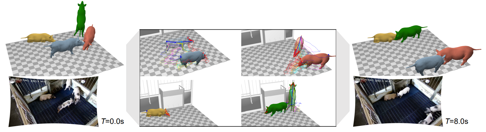
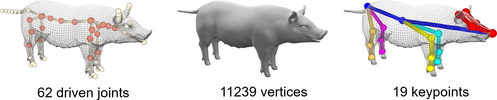
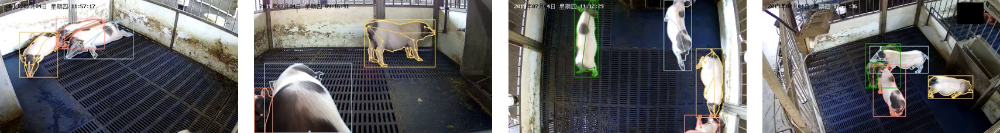

# MAMMAL

This repository contains the core code of **MAMMAL** system proposed in paper _Three-dimensional surface motion capture of multiple freely moving pigs using MAMMAL_. 
This is the **first** system demonstrating pose and shape reconstruction of socially interacting animals. Moreover, it is the **first** system to analyse pig behavior in three-dimensional space. 

## Installation 
The code is written using C++ Std 17 on Visual Studio Community 2017. Please refer to `docs/INSTALL.md` for installation guide. 

## Quick demo 
Please refer to `docs/Demo.md`. 

## The PIG model 
To enable the MAMMAL system, we proposed a new pig articulation model named `PIG` model, as in the link https://github.com/anl13/PIG_model. This link contains necessary details and code for you to understand the model. 


## BamaPig2D and BamaPig3D dataset 
Check out link https://github.com/anl13/MAMMAL_datasets for descriptions of these datasets. Briefly, BamaPig2D dataset contains 3340 images with more than 10k pig instances fully labeled with bounding boxes, silhouettes and keypoints, and is formated in COCO style. We also provide a modified COCO annotation file suitable for training [SLEAP](https://sleap.ai). BamaPig3D dataset provides synchronized 70-second videos of 10 views (1750 frames, 25FPS). We manually labeled 2D keypoints, 2D silhouettes and 3D mesh/keypoints every 25 frames, resulting in 70 fully labeled frames. BamaPig3D dataset is used for evaluating the performance of MAMMAL system. However, it is also suitable for training 3D algorithms (e.g. [DANNCE](https://github.com/spoonsso/dannce) or [LiftPose3D](https://github.com/NeLy-EPFL/LiftPose3D)). The figure shows examples of BamaPig2D dataset. 


## MAMMAL detection 
MAMMAL detection contains two seperate parts: pig bounding box and silhouette detection modified from Detectron2, and pig pose detection modified from HRNet. Please refer to https://github.com/anl13/pig_silhouette_det and https://github.com/anl13/pig_pose_det for more details. 

## Evaluation 
Key evaluation code is released at https://github.com/anl13/MAMMAL_evaluation. It helps reproduce some figures of the paper. The results used for evaluation are also provided together with the code. Our provided results perfactly match the paper figures. However, if run the algorithm again, it may change a little (because we have updated the code recently), but not much. 

## Pig behavior analysis 
Please refer to code https://github.com/anl13/MAMMAL_behavior for behavior analysis performed in the paper. 

## Rendering 
To effectively render the model in python environment, we developed a `pig_renderer` as in https://github.com/anl13/pig_renderer. 

## Q&A 
If you come up with any problem during testing MAMMAL, do not hesitate to propose an issue on github. I will reply when I see them. 

## Citation
If you use these datasets in your research, please cite the paper

```BibTex
@article{MAMMAL, 
    author = {An, Liang and Ren, Jilong and Yu, Tao and Hai, Tang and Jia, Yichang and Liu, Yebin},
    title = {Three-dimensional surface motion capture of multiple freely moving pigs using MAMMAL},
    booktitle = {},
    month = {July},
    year = {2022}
}
```