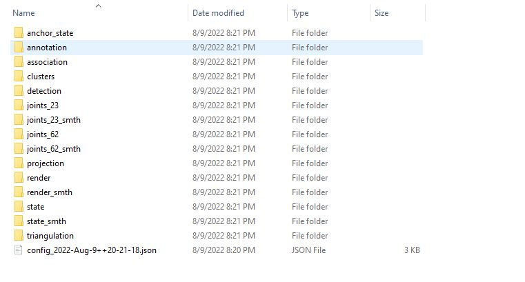
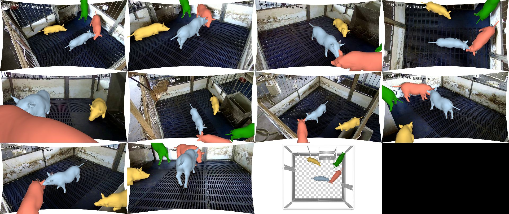

# Demo on BamaPig3D dataset 
## Step1: prepare BamaPig3D dataset. 
Refer to https://github.com/anl13/MAMMAL_datasets to download the BamaPig3D dataset (the txt version, not the pkl version!). Denote the dataset path as `${BamaPig3D_parent}/BamaPig3D/`. 

## Step2: modify config file. 
The project `posesolver` will first read the config file specified in file `main_config.json` (see `Resources` under `posesolver` project). By default, `main_config.json` specifies `config_BamaPig3D_main.json` as running config. 

To successfully run it, you **MUST** change some configurations in `config_BamaPig3D_main.json`. 

| config key | value |
| --- | --- |  
| sequence   | Your own path of BamaPig3D dataset | 
| camfolder | Change the prefix part `H:/MAMMAL_core/` to your own project folder. E.g. if your project is `C:/MAMMAL_core/`, then set `camfolder` as "C:/MAMMAL_core/data/calibdata/extrinsic/"| 
| scenedata | Change the prefix part `H:/MAMMAL_core/` to your own project folder. | 
| background_folder |  Change the prefix part `H:/MAMMAL_core/` to your own project folder.| 
| pig_config | Change the prefix part `H:/MAMMAL_core/` to your own project folder.|
| result_folder | Change `H:/results/BamaPig3D_main/` to your folder for saving the results. | 
| annotation_folder | Change the prefix `H:/results/BamaPig3D_main/` to your `result_folder` value. |
| anchor_folder| Change the prefix `H:/results/BamaPig3D_main/` to your `result_folder` value. |

Then, keep other config keys as default. 

## Step3: Run posesolver 
Right click on the `posesolver` project and set it as the start project. Click `Local Windows Debugger`, it will compile and run! The compilation may take several minutes to finish. If you successfully run it, you will see a black commmand window printing some log information like 

Then, under your own result folder, you will get some folders like 

Then, just wait to see the results under `Render` folder.  

If you get something like 
 
Congratulations! You have succeeded to run the project. 