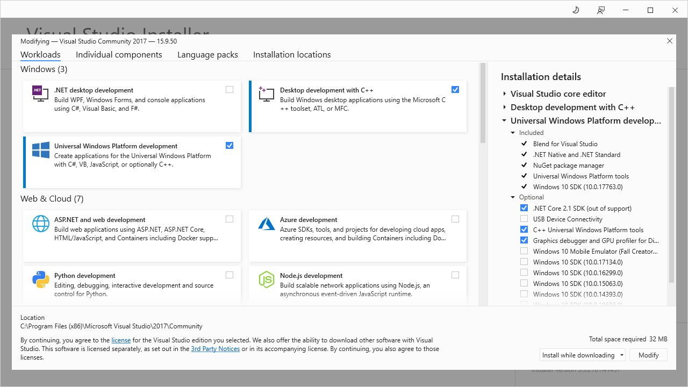
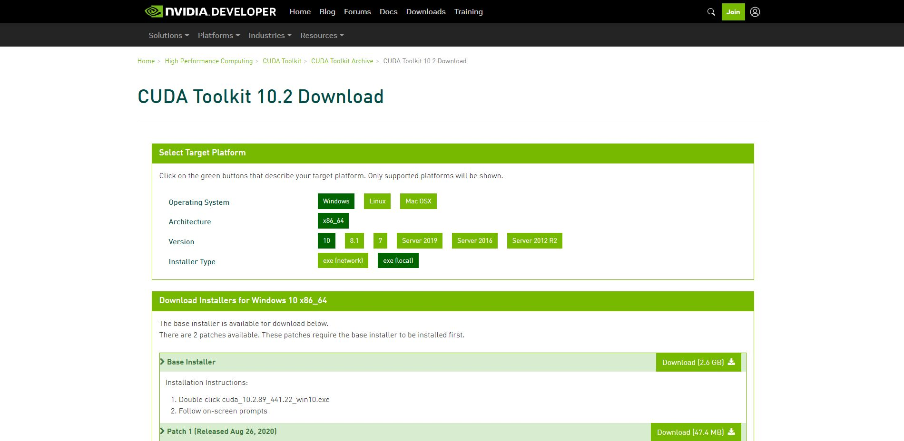
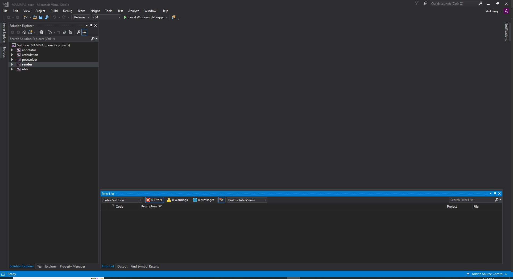
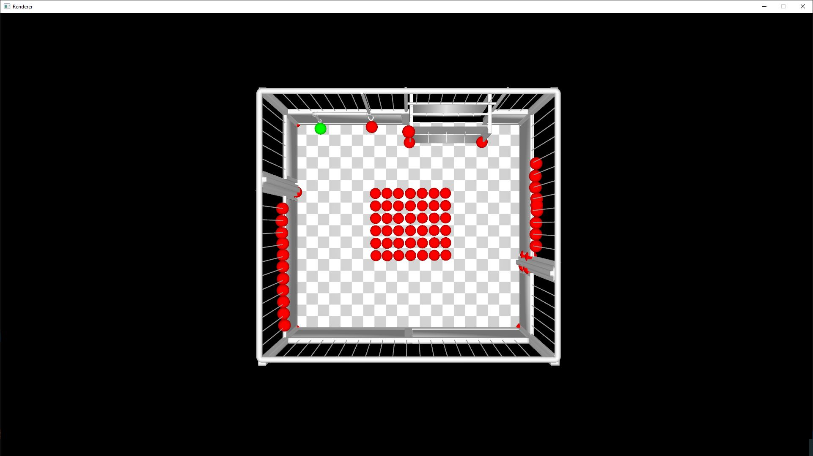

# Configure and run MAMMAL_core

## Install Visual Studio Community software and CUDA package
For experienced C++ programmers, you must know how to use Visual Studio with CUDA. However, for Python programmers, or for users not familiar with C++, it would be a long journey to successfully running the code. However, I would still try my best to explain detailed steps to configure the project. In the future, I may implement a python version of MAMMAL to make it more accessible. 

The very first step of configuring the project is preparing operating system and installing necessary development softwares. 
1. Prepare Window 10 operating system. Make sure there is at least 30GB space in `C:/` disk. 
2. Download `Visual Studio Community 2017` installation file from this link (https://visualstudio.microsoft.com/zh-hans/thank-you-downloading-visual-studio/?sku=Community&rel=15). By default, it will download the an installer named `vs_community__5b56df20afe84042bb0d58164b03fdfb.exe`. By click on it, you may see a dialogue 



Please click the options as the above image shows. The whole installation takes 20.62GB space in `C:/` disk by default. Note that, because I have installed it, the size in the image is not the true size for initial installation. Although you are free to change the 'Installation locations' as you like, we recommend to maintain the default folder for CUDA to identify Visual Studio. 

After about 20 minutes, the installation will finish. 

3. Download the CUDA 10.2 installation file from https://developer.nvidia.com/cuda-10.2-download-archive. Choose the installer like 

Download the installer (2.6G size) and install it with default options. It will automatically add CUDA support to Visual Studio 2017. 
4. Download and install CUDNN. Download cuDNN v8.5.0 for CUDA 10.2 from https://developer.nvidia.com/rdp/cudnn-download (You may need to login to Nvidia Developer to access the file). You will download a zip file. Then unzip it, you will see three folders named "bin", "include", "lib". Copy all of them to `C:\Program Files\NVIDIA GPU Computing Toolkit\CUDA\v10.2\` directly, and the installation finishes!

**Some Notes** : This may work for NVIDIA RTX 2080Ti or NVIDIA TITAN X gpu. For newer gpus with higher architectures, it may require higher version of CUDA and corresponding cuDNN. Please carefully check that!

## Download MAMMAL\_core
1. First, you should download the code `MAMMAL_core` to your own path. Lets call it `{PARENT_DIR}/MAMMAL_core/`.  

2. You need to download some necessary data from [Google Drive](https://drive.google.com/file/d/1m9hKCMhI_VJb1muM-sS_01TgYdDqaz3D/view?usp=sharing). The file you download is `data.zip`, just unzip it and put it under the MAMMAL\_core main folder. Then, download data files for render from [Google Drive](https://drive.google.com/file/d/1xZqepoemvG6aPBnMBn69cvaUKz5JMlZd/view?usp=sharing) and unzip it under `render/` folder like 
```
\-- MAMMAL_core\
    \-- data\
    |-- annotator\
    |-- articulation\
    |-- configs\
    |-- posesolver\
    |-- props\
    |-- render\
        \-- data\
        |-- shader\
    |-- utils\
    |-- .gitignore
    |-- README.md
    |-- MAMMAL_core.sln
```

## Build 3rdparty libraries
MAMMAL\_core relies on the following libraries compiled with Visual Studio 2017. 
```
boost-1.79.0
ceres
eigen3 
jsoncpp 
nanogui 
opencv 4.5.0
opengl 
glad 
glfw 
pcl 1.9.1 
```
If you use a different version of Visual Studio or a different version of CUDA, you would better to re-compile the libraries from source. If you use the same software to me,  you can download pre-compiled ones from the link (https://drive.google.com/file/d/1Df-p3nQLE5lPo999eOvaKY59sMQurmW9/view?usp=sharing). Then unzip the third-party libraries and put it under the MAMMAL_core main folder. You will get a folder structure like  
```
\-- MAMMAL_core\
    |-- 3rdparty\
    |-- data\
    ...
    |-- README.md
    |-- MAMMAL_core.sln
```

## Open the project
Click on the `MAMMAL_core.sln` (Visual Studio solution file), it will be opened by Visual Studio Community 2017 automatically. If you load the project successfully, you will see 


Note that, on the left of the green triangle buttom "Local Windows Debugger", choose "Release" and "x64" setting. 

## Run render demo 
The whole MAMMAL\_core solution contains five projects named `annotator`, `articulation`, `posesolver`, `render`, `utils`. Their functions are 
* annotator 

It is a GUI (graphical user interface) for pig pose tunning. See `Demo.md` for more details. 
* articulation 

It contain the core code for how to pose the PIG model and how to optimize the poses according to observations. 

* posesolver 

It it the main source code for MAMMAL pipeline. See `Demo.md` for more details. 

* render 

It contains the code for 3D rendering. 

* utils 

It contains code for basic mathmatical or geometric operations. It also contains basic image operations. This porject does not have a `main` function, so it could not be run. 

As a initial test, we recommend to run `render` project. 

1. Right click on the `render` project, and click `Set as StartUp Project`. 
2. Click `Local Windows Debugger`, it will first build the code and them run the code. If everything is ok, you will see a rendering window like this 

3. You have succeeded to run the first demo of MAMMAL\_core now! 

Please refer to `Demo.md` for how to run on the sequence of BamaPig3D. 
